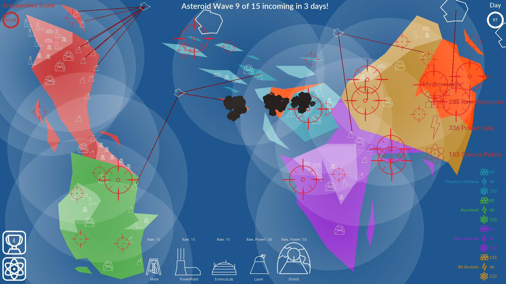
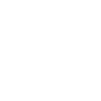
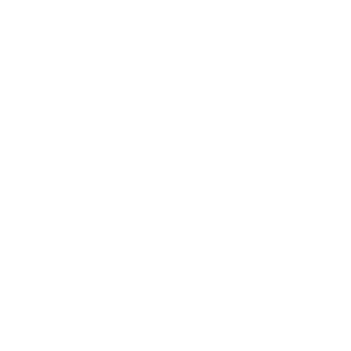
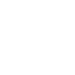

# Asteroid Apocalypse

You and up to 4 of your friends are leaders in charge of protecting your countries from an incoming ASTEROID APOCALYPSE! Band together for a thrilling, real time, cooperative strategy game. Build shields and lasers to protect yourself and your neighbors. Build mines, power plants and labs to improve your economy. Research new technology to improve your buildings. Give to those in need when you have plenty. Who among your friends will come out on top? Will you even survive AT ALL?

## Coopertition

The goal of Asteroid Apocalypse is to get the highest score while protecting your nation from falling asteroids. If any nation loses all of their territories, the game is over for everyone. You can only with if you all make it through the asteroid waves. You can help out your fellow nations by gifting them resources if an asteroid has targetted their territory and they haven't been able to build enough shields or lasers yet. The more you give, the more your score goes up, so be generous!

See if you and you friends can make it to the end! Good luck!

## Controls

| Input       | Action                             |
| ----------- | ---------------------------------- |
| Mouse Wheel | Zoom In/Out on the map             |
| MMB & RMB   | Hold and drag to pan the camera    |
| W/A/S/D     | Move the camera up/left/down/right |
| T           | Open/Close Tech Tree               |
| Tab         | Open/Close Leaderboard             |

## Buildings

| Building    | Icons                                                                                         | Purpose                                                  |
| ----------- | --------------------------------------------------------------------------------------------- | -------------------------------------------------------- |
| Mine        | 

                   | Generates raw resources stored for building              |
| Power Plant | 

 | Generates power cells used for making defenses           |
| Lab         | 

                     | Generates science points for research                    |
| Shield      | 

               | Protects against asteroids that impact within its radius |
| Laser       | 

               | Shoots down asteroids that fall through its radius       |

## Research

| Building    | Level 1                                               | Level 2                                                | Level 3                                               |
| ----------- | ----------------------------------------------------- | ------------------------------------------------------ | ----------------------------------------------------- |
| Mine        | Produces 1 unit raw resources per day                 | Produces 2 units of raw resources per day              | Produces 3 units of raw resources per day             |
| Power Plant | Produces 1 power cell per day                         | Produces 2 power cells per day                         | Produces 3 power cells per day                        |
| Lab         | Produces 5 science points per day                     | Produces 10 science points per day                     | Produces 15 science points per day                    |
| Shield      | Protects against one small asteroid before going down | Protects against one medium asteroid before going down | Protects against one large asteroid before going down |
| Laser       | Shoots at incoming asteroids                          | Increased range                                        | Increased range and slightly increased damage         |

## Important Mechanics

- Mines, Power Plants and Labs can only be placed on lightly colored "Resource Tiles"
- Lasers and Shields cannot be placed on Resource Tiles
- Asteroids never target the ocean
- There's a small circle around each building
- In the bottom right you'll see the other players and their resources, clicking on one of the miniature resource icons will give that player 1 of that resource. If you hold shift or control you will give 10 or 100 resources respectively.

## A Decent Strategy

1. Spend all starting materials on 3 mines and a power plant
2. Build a shield
3. Build a couple more mines, and another power plant
4. Build a laser
5. Build a couple labs
6. Improve economy when low on resources from now on
7. Build another shield
8. Keep building lasers (and the occasional shield) whenever possible

## Multiplayer Support

Asteroid Apocalypse supports multiplayer over the internet. Unfortunatley, the networking is not as optimized as it should be and works best over a local network rather than over the internet. It will work over the internet, but it gets pretty laggy when the action gets intense.

# Game Journal

Check out the [Journal](docs/journal.md) for a log of our progress!
