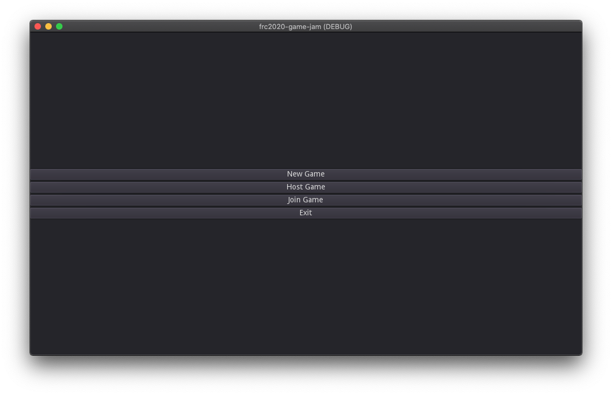
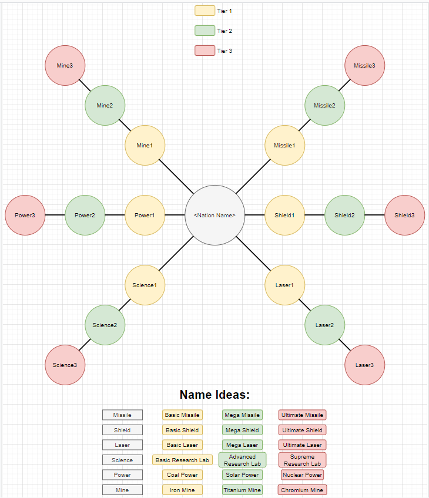
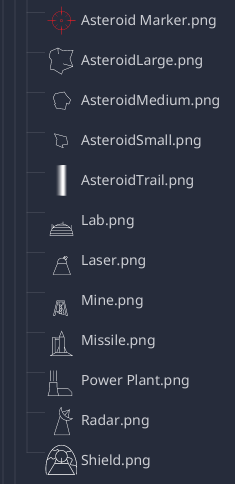
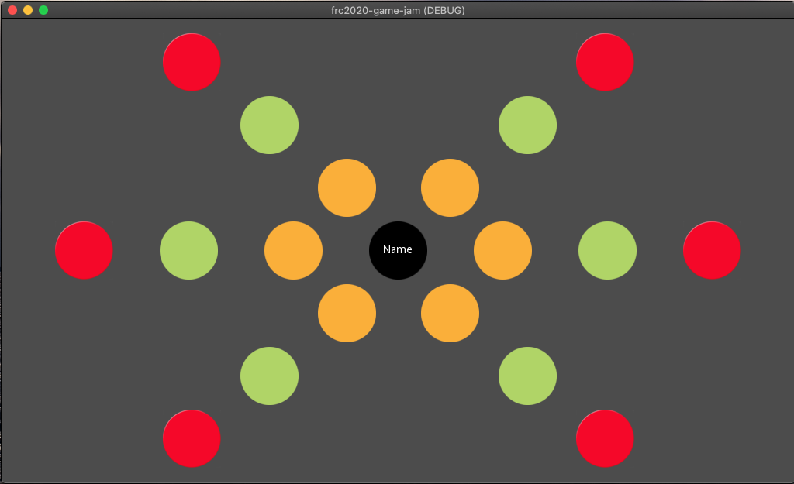
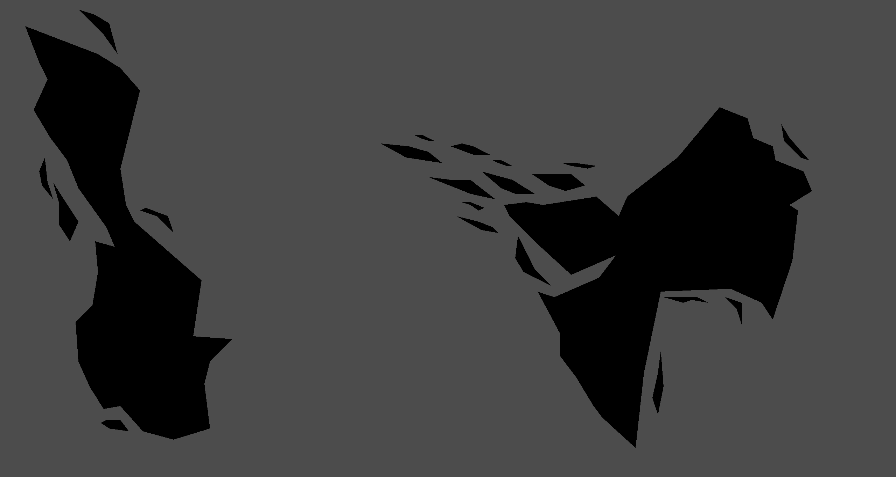
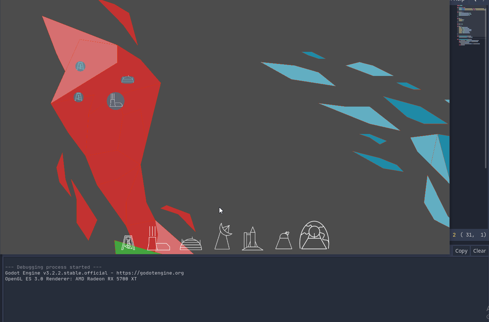
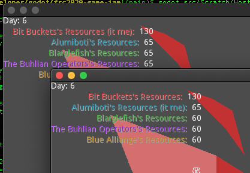
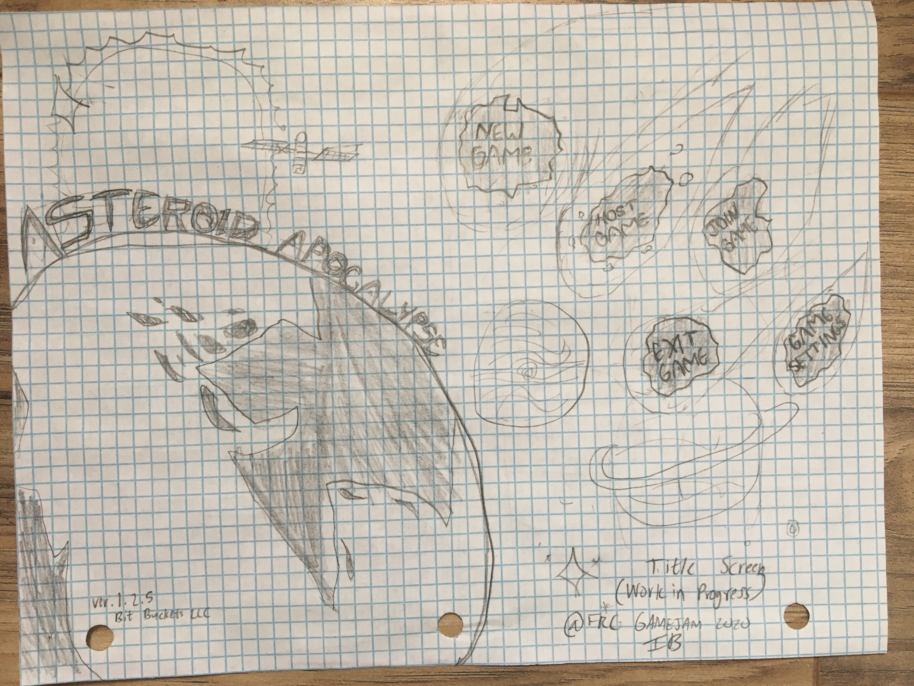
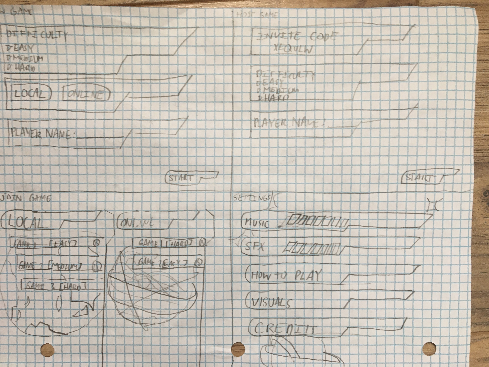
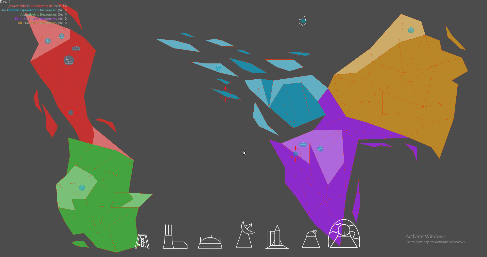

# Developer Journal

This journal is a log of the various improvements each developer made during the game jam.

## 11/7/2020

The game jam has begun! The team had a meetup to discuss ideas for a game with Coopertition. We came up with 3 main ideas:

- An **earth sim** where each nation is competing for resources but protecting the whole planet against an imminent threat like asteroids, alien attacks, climate change, etc.
- A **cooperative paltformer game** competing for points, ala multiplayer platformers where the highest score wins. Optionally working together to solve puzzles with more intricate solutions scoring more points.
- **Wait staff sim** where the players control waiters competing at a restaurant for tips. Helping other wait staff's customers makes everyone in the restaurant happier and tip more, but you want to get the most tips.
- **FRC Pit Crew** game where you have to repair your team's robot as it is constantly being broken during matches. You also have to go to other pit crews to trade for parts and help them repair.

We quickly settled on the Earth Sim with an asteroid threat, missiles and laser defense, and any nation being destroyed means game over for everyone.

### OS

Created initial gamejam project

### CP

Network testing with godot, can we use a dedicated server? Yes.

### SM

Tech Tree and Research Screen Mockup

### EP

Create icons and set tone for art style.

### IB

Researched menu designing godot

## 11/9/2020

### OS

Created Player and World scenes and Signals Singleton

### CP

Design and task management.
More networking.

### SM

Tech Tree godot screen layout

### EP

Map design

### IB

...

## 11/10/2020

### OS

Buildings can be placed on territories.

### CP

...

### SM

...

### EP

...

### IB

...

## 11/11/2020

### OS

...

### CP

More networking work today. Player Management is better structured, and each player that joins and assumes one of the AI players.

### SM

...

### EP

...

### IB

Menu Mockups

## 11/12/2020

### OS

Working on asteroids destroying territories and buildings.

### CP

More networking work today. Player Management is better structured, and each player that joins becomes another player

### SM

...

### EP

...

### IB

...

## 11/13/2020

### OS

...

### CP

New HUD with player gifting!

### SM

...

### EP

...

### IB

...
