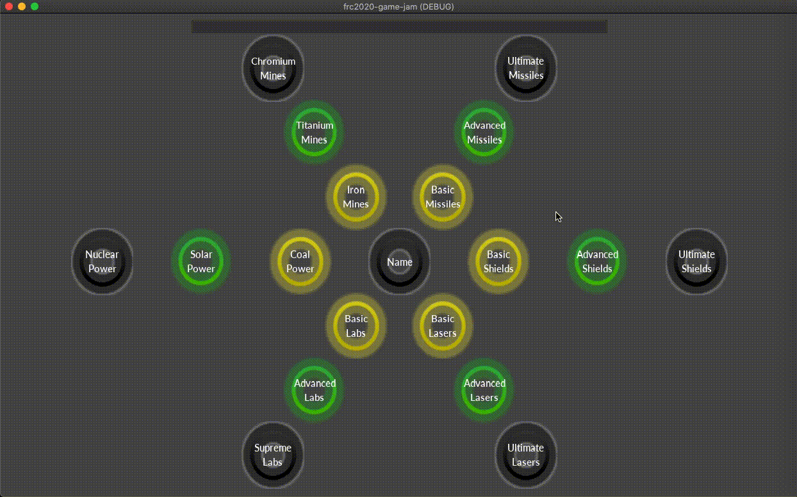
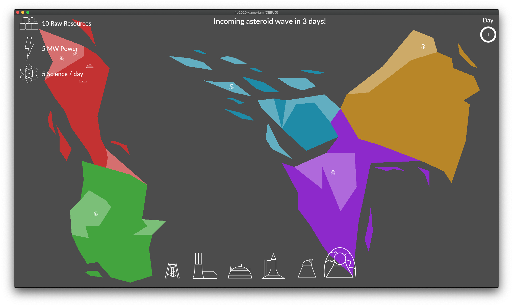

# Developer Journal

This journal is a log of the various improvements each developer made during the game jam.

---

## Credits

- Craig Post - mentor/team leader/networking
- Ojas Sanghi - Game logic, core engine, and Godot evangelist
- Sap Mallick - Research Tree, Research and Score
- Elias Post - Asteroids, Lasers, Shields and Game Balancing
- Ibrahim Bah - Menu Design/Game Design
- Kevin Forbes - Testing/Lobby autoscroll/UI Improvements
- Howard Beck - Playtesting and Feedback

## 11/7/2020

The game jam has begun! The team had a meetup to discuss ideas for a game with Coopertition. We came up with 3 main ideas:

- An **earth sim** where each nation is competing for resources but protecting the whole planet against an imminent threat like asteroids, alien attacks, climate change, etc.
- A **cooperative paltformer game** competing for points, ala multiplayer platformers where the highest score wins. Optionally working together to solve puzzles with more intricate solutions scoring more points.
- **Wait staff sim** where the players control waiters competing at a restaurant for tips. Helping other wait staff's customers makes everyone in the restaurant happier and tip more, but you want to get the most tips.
- **FRC Pit Crew** game where you have to repair your team's robot as it is constantly being broken during matches. You also have to go to other pit crews to trade for parts and help them repair.

We quickly settled on the Earth Sim with an asteroid threat, missiles and laser defense, and any nation being destroyed means game over for everyone.

Here is our [brainstorm](brainstorm.md) document we came up with while throwing out ideas.

### OS

Created initial gamejam project

### CP

Network testing with godot, can we use a dedicated server? Yes.

### SM

Tech Tree and Research Screen Mockup

### EP

Create icons and set tone for art style.

### IB

Researched menu designing godot

---

## 11/8/2020

### OS

- Work on the general world scene, and separate our Enums into a singleton so that it's accessible from anywhere.
- Created Signals singleton for easy node signal communication

### CP

- Created Territory CollisionPolygon2D node for map editing

### SM

- Tech tree initial UI design with Godot UI and circles
- Hooked up each tech button to signals

### EP

- Built initial map
- Created Building Icons

### IB

..

### EP

Map design

---

## 11/9/2020

### OS

Created Player and World scenes and Signals Singleton. Also created camera system for the map

### CP

Design and task management.
More networking.
Managed to get the client and server in sync

### SM

Added Tech Tree nodes with textures
Added a costs dictionary to hold each Tech's cost
Added a popup that opens when the player clicks on a node
Players can research tech and it updates their data accordingly
Tech Tree godot screen layout

### EP

..

### IB

...

---

## 11/10/2020

### OS

Buildings can be placed on territories, and they also cost resources.

### CP

- Assisted student with asteroid logic and gdscript issues.
- Added get_territories() logic to get all territories in a map for asteroid selection.
- Worked on PlayersManager to create 5 human or ai players and manage all their data

### SM

Tech Tree UI improvements (labels, readability)

### EP

Initial asteroid mechanic implemented

### IB

Began designing menu system

---

## 11/11/2020

### OS

Worked on cursor changing based on whether or not a building is being placed or not
For example, if the user has a mine selected and their mouse is over a non-resource tile, the cursor will show a "forbidden" icon.

### CP

More networking work today. Player Management is better structured, and each player that joins and assumes one of the AI players.

### SM

HW is amazing, so that's why I worked on that

### EP

Asteroids now destroy tiles!

### IB

Menu Mockups

---

## 11/12/2020

### OS

Working on asteroids destroying the buildings on a destroyed tile.
As you can see in this gif.. it didn't exactly pan out in the beginning.

### CP

More networking to fix players joining and assuming AI. Added multiplayer support for asteroid spawning, position and impact.
Also added support for multiplayer building placement!

### SM

Worked on tech tree (UI fixes, added keybind), nodes change based on whether or not players can research a tech, and it shows a progress bar! (ignore weird GIF compression)

### EP

Worked on a wave system for the asteroids! (ignore weird GIF compression)

### IB

...

---

## 11/13/2020

### OS

Buildings show a hitbox radius when being placed so you have a better idea of where you can and can't place it:

Additionally, I got a basic AI running, which automatically places buildings in a pre-defined sequence at pre-defined spots when it has the money to.

### CP

- New HUD
  

- Players can now give gifts to other players. Coopertition mode enabled!
- Each button turns into a plus icon when you hover over it.

- Music! Ievan Polkka, but less dancing cats and more techno.
- LASER NOISES. Pew Pew!
- Click sound
- New gifting icons

- Added networked asteroid destroy event

### SM

Worked on score - granted score based on a variety of events (like building, asteroids, researching, donating)
Added a basic leaderboard
Removed missiles :(

### EP

Worked on balance, and added lasers!

### IB

...

---

## 11/14/2020

### OS

- Implemented WASD controls for the camera pan

Many AI improvements

- AI was now on all the countries and automatically turned on/off based on whether or not there was a real player connected
  - There was ~~many~~ _some_ bugs with this, but we got them sorted out eventually
- After AI's built the 10 pre-defined buildings, they would spam lasers in random areas.
  
- The AI now researched in the tech tree as well, so that it wouldn't be at too much of a disadvantage.

  - There were also some bugs with this where even if the AI was turned off (if a player was connected), it would still research for the player.  
    Turns out the function call for researching tech was outside of the if-statement which decided whether or not to execute the AI code.

- Additionally, I implemented some smoke particles for when asteroids destroyed tiles!
  

### CP

- Main Menu, Settings + Host/Join + Lobby menus written

- Shield events syncing over network
- Tested multiplayer over local network with EP

**Quality of life improvements**

- Added settings to disable music and saving port/host for next session
- Added display for which asteroid wave we're on
- Made end game conditions disconnect from the network

### SM

Leaderboard UI improvements (awesome new textures), research bug fixes

### EP

Buildings improve with research!

### IB

...

---

## 11/15/2020

**The final day!!**

### OS

As one final feature - one that was on my to-do for multiple days at this point, as well as one that would nicely complement the smoke - I implemented a camera shake for when asteroids hit tiles:

This was implemented around 10:40 AM (MST, so 12:40 et) and the next 3 or so hours were devoted to various small features and bug fixes throughout the game:

- Added a Quit option so that the player can go back to the main menu by pressing Q
- You can now pan with right click as well so that people without mouses/people who macs (smh) can move around
- Some score balance changes where people who destroy/deflect asteroids don't gain points otherwise Orange and random countries in Europe would get an unfair advantage
- Changed window scaling options so that the aspect ratio would be maintained. One of our teammates tested it on their ultra-wide, and results were... not optimal
- Showed the cost of a building above it so that the player has a better idea of how much they need to build something
- Made the bg blue since the ocean is blue
- Implemented code to darken the building button at the bottom if you can't afford it
  - This is a bit buggy, but it works enough
- Fixed a bug where you would lose randomly

Around 2 PM or so (it was due at 4 pm for us) we began to transition to testing networking and multiplayer (and CP fixed them!), and we tagged our release just 20 minutes before it was due!

### CP

**More Quality of life improvements**

- Wave `n` of `m` title text
- Final asteroid countdown timer
- Easy mode
- Asteroid strike noise to complement OS's screen shake!
- Added EP's human/robot icons to lobby
- Leaderboard/Tech Tree icons so SM's awesome features will be discoverable

**LOTS of multiplayer fixes**

- Throw error popup if the server disconnects you
- Moved a bunch of less important things to use udp for network
- Changed player/asteroid serialization to use array instead of dict
- Finally located networking bug that was causing an infinite RPC loop between server -> client -> server -> client, etc

Most importantly, the team all played a multiplayer game together and WON! Hooray!

### SM

Added a way to view the leaderboard when the game ends

### EP

Updated documentation, last minute fixes and improvements!
[README](../README.md)

### IB

...
